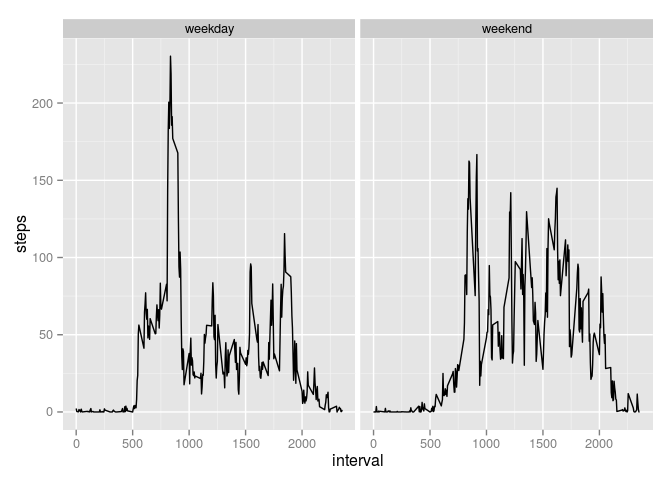

# Reproducible Research: Peer Assessment 1


## Loading and preprocessing the data

```r
unzip("./activity.zip")
data<-read.csv("./activity.csv")
```

## What is mean total number of steps taken per day?

```r
steps<-tapply(data$steps, data$date, sum)
hist(steps, main='total number of steps taken each day')
```

 
  
**Calculates and reports the mean and median total number of steps taken per day**

```r
summary(steps)[3:4]
```

```
## Median   Mean 
##  10760  10770
```
## What is the average daily activity pattern?

```r
completed<-data[!is.na(data$steps),]
intervals<-unique(completed$interval)
average <- tapply(completed$steps,completed$interval,mean)
plot(average ~ intervals, type = 'l')
```

 
  
**5-minute interval, on average across all the days in the dataset, contains the maximum number of steps:**

```r
average<-data.frame(cbind(steps=average, interval=as.numeric(names(average))), stringsAsFactors = NULL )
average[which.max(average$steps),]$interval
```

```
## [1] 835
```
## Imputing missing values
**Total number of missing values in the dataset:**

```r
sum(!complete.cases(data))
```

```
## [1] 2304
```

**Filling in all of the missing values in the dataset with MEAN**

```r
merge<-merge(data,average,by.x="interval",by.y="interval")
merge$steps.tidy<-ifelse(is.na(merge$steps.x),merge$steps.y,merge$steps.x)
```

**Original dataset but with the missing data filled in**

```r
tidy_dataset<-data.frame(interval=merge$interval,date=merge$date,steps=merge$steps.tidy)
```

**Shows the impact of imputing missing data on the estimates of the total daily number of steps**  

```r
tidy_steps<-tapply(tidy_dataset$steps, tidy_dataset$date, sum)
hist(tidy_steps, main='total number of steps taken each day')
```

 


```r
summary(tidy_steps)[3:4]
```

```
## Median   Mean 
##  10770  10770
```
## Are there differences in activity patterns between weekdays and weekends?

**new factor variable in the dataset with two levels – “weekday” and “weekend” indicating whether a given date is a weekday or weekend day  **

```r
tidy_dataset$day<-ifelse(as.POSIXlt(as.Date(tidy_dataset$date))$wday %in% c(0,6), "weekend" ,"weekday")
tidy_dataset$day<-as.factor(tidy_dataset$day)
```

**Plot containing a time series plot (i.e. type = "l") of the 5-minute interval (x-axis) and the average number of steps taken, averaged across all weekday days or weekend days (y-axis).  **
 

```r
library(ggplot2)
agregatted<-aggregate(steps~interval+day,tidy_dataset,mean)
ggplot(agregatted, aes(x=interval, y=steps)) + geom_line() + facet_grid(. ~ day)
```

 
